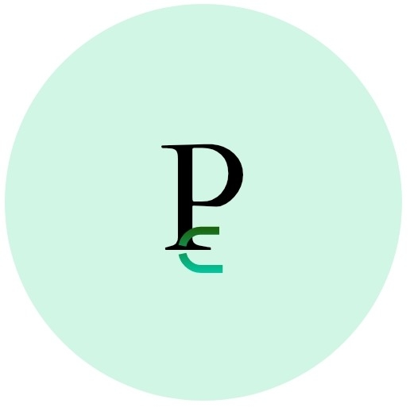

# Predicta Expense WEB 🌐💰🔮 
 
 
### An user friendly web interface with clean UI and smooth UX, based on the '***PredictaExpense-cpp***' CLI.
### The web interface incorporates essentials of HTML5 and CSS with modular file approach for easier **readability**, **scaling** and **updating**.
---
## Features ⚙️
* User friendly interface
* Clean and modern UX
* Sleek UI
* Smooth functionality (static operations)
* Planned functionalities of '***PredictaExpense-cpp***' CLI

## Tech stack 🪛🪛
* Languages:
  * **HTML5**
  * **CSS**
* Paradigm:
  Basic Front-end development
* Concepts practiced:
     * Modular file programming
     * Core HTML5
     * Inline CSS
     * External CSS
* Interface:
  **Web-based** (GUI)

## How to RUN 🔛
* Open the live-link given below to access the website :
      *https://tecnolgd.github.io/Predicta-Expense-Web* (*by Github pages*)

## Future Upgrades  🚀🚀
* Refractor of code using Javascript.
* Add functionality (using Javascript).
* Smoother UI and UX.
* **Cross-device** compatibility.
* Add new data representation.
* Convert to **full stack front-end**.
* **Gold nugget**: ML model for predictive insights rather than stale averaeg_of_expense formula.

## Recent add-ons ➕
* [x] Live Web-link
* [x] Comments in source code
* [x] Code indentation and clean-up
* [x] Feedback option for **non-github users**.
* [x] Issue tab shortcut for Github geeks
* [ ] **Front-end deployment**(planned)
* [ ] Coming soon !

## Privacy Note 🔒
* This project is solely made for **educational** and Feedback-based learning for improving Web development skills and get **insights** from fellow devs and tech geeks.
* This project uses **Google Analytics (GA4)** for feedback collection based on user engagement and various other traffic.
* **Personal data of visitors won't be collected in any means**.
* **Feedback based learning** is the sole objective of this project.

## Feedback Guidelines 📜
* Feedback can be given using the **Issues/Feedback** button in the homepage of the website.
* This button will direct the user to the feedback page with an integrated **Google form**(for non-github users/minimal braincells usage)
* Users are recommended to give **honest** feedback for the website.
* Feedback can be for topics like *color palatte*, *responsiveness*, *UI*, *UX*, *overall feel and user-friendliness*, etc.
* Please be respectful in your feedback.
* Your **feedbacks are appreciated** and means a lot.

## Aim of the Feedback collection 🎯
* As mentioned, the project / website is currently in a young stage, where its only a static site with some button operations.     
* As planned, **the website would be developed as a frontend** in the coming days as the roadmap.    
* **Getting feedback early** for incorporating any changes in the base structure of the website would be a **sensible risk** for the final working website.

## Value this repo?💫     
* If you felt this repo to be useful or added knowledge to your dev workflow/skill-building, consider dropping a ⭐️ or hitting *fork*.
* Open for feedbacks or knowlegde exchange.
---
#### Author  
  ***tecnolgd***

